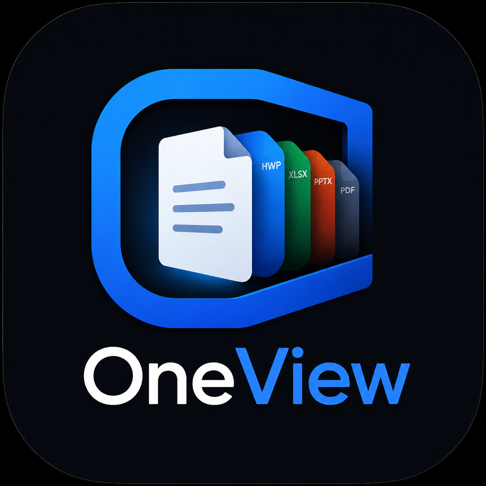

<div align="center">
  
  <h1>OneView</h1>
  <p><b>PDF · 한글(HWP/HWPX) · Word · Excel · PPT · 이미지</b>를<br>광고 없이 바로 여는 무료 문서 뷰어. <b>Android 앱 + 웹앱(PWA)</b>.</p>
  <p><sub>PowerPoint는 외부 라이브러리 없이 <b>OOXML을 직접 파싱하는 자체 캔버스 렌더러</b>로 그립니다.</sub></p>
  <p>
    
    
    
    
  </p>
</div>

---

## 📥 사용하기

**🌐 웹앱(설치 없이 바로): [jinukmoon.github.io/oneview](https://jinukmoon.github.io/oneview/)**
폰·PC 브라우저에서 위 주소를 열면 바로 실행됩니다. 홈 화면에 추가하면 앱처럼 오프라인으로도 씁니다(안드로이드 Chrome은 "앱 설치" 안내, iOS는 Safari 공유 → 홈 화면에 추가).

**📱 Android 앱(APK): [OneView.apk 받기 (항상 최신)](https://github.com/JinukMoon/oneview/releases/latest/download/OneView.apk)**
폰에서 위 링크를 누르면 APK가 바로 받아집니다. 설치 시 **"출처를 알 수 없는 앱 허용"** 을 한 번 켜 주세요. (Android 13/14 기준)
앱은 웹앱과 달리 **카톡·메일에서 파일을 누르면 OneView가 후보로 떠서 바로 열립니다.**

---

## 왜 만들었나

휴대폰에서 문서를 열려면 포맷마다 앱이 따로고, 대부분 **광고·로그인 범벅**입니다.
특히 **HWP/HWPX는 휴대폰에서 멀쩡히 볼 무료 수단이 거의 없습니다.**

OneView는 **하나의 진입점**에서 대부분을 직접 열고, 직접 못 그리는 건 가장 잘하는 앱으로 넘깁니다.

> **광고 없음 · 로그인 없음 · 서버 없음(오프라인) · 무료.**
> 파일은 폰 밖으로 나가지 않습니다.

---

## 지원 포맷

| 형식 | 처리 방식 |
|---|---|
| **PDF** (한글 폰트 포함) | 인앱 렌더 · 확대 시 해당 배율로 다시 그려 선명 (pdf.js) |
| **HWP** (.hwp) | 인앱 시각 렌더 (@rhwp/core, WASM) |
| **HWPX** (.hwpx) | 인앱 시각 렌더 (@rhwp/core, WASM) |
| **Word** (.docx) | 인앱 렌더 · 표/스타일 유지 (docx-preview) |
| **Excel** (.xlsx/.xls) | 인앱 표 렌더 · **시트 탭으로 전환** (ExcelJS, SheetJS 폴백) |
| **PowerPoint** (.pptx) | **자체 제작 OOXML 렌더러**로 인앱 렌더 · 배경·도형·표·그룹·마스터/레이아웃까지 · **슬라이드 세로 스크롤** · 확대 시 고해상도 재렌더 |
| **이미지** (jpg/png/gif/webp/svg …) | 인앱 렌더 |
| **텍스트** (txt/csv/md/json/xml …) | 인앱 · 한글 인코딩 자동 감지(UTF-8/EUC-KR) |
| 그 외 (.doc/.ppt/.rtf/.odf/.epub · HEIC/HEIF …) | 설치된 앱으로 자동 전달 |

---

## 주요 기능

- **📐 화면 중앙 기준 확대/축소** — 핀치 + 버튼 줌(25%~600%). 보고 있던 지점을 기준으로 커지고 작아져서(핀치는 두 손가락 중앙 기준) 확대해도 위치가 튀지 않습니다.
- **🔍 PDF는 확대할수록 선명** — 보는 배율에 맞춰 페이지를 다시 렌더링(메모리 상한 내). 페이지 크기가 섞인 문서(세로+가로)도 각자 비율 유지.
- **🖼 슬라이드/페이지 세로 스크롤** — PPT는 슬라이드가 위→아래로 쭉, 아래로 넘기며 훑어볼 수 있습니다.
- **📑 엑셀 시트 전환** — 상단 고정 탭 버튼으로 시트를 골라 이동.
- **🏠 홈/뒤로가기** — 상단 홈 버튼 + 안드로이드 하드웨어 뒤로가기로 문서에서 언제든 첫 화면으로.
- **🌙 다크 모드 + 야간 반전(다크 리더)** — 흰 문서를 어둡게 반전(사진은 원색 유지).
- **🔎 문서 내 검색** — Word/Excel/HWPX/텍스트에서 하이라이트 검색.
- **🕘 최근 본 파일** — 카톡 다시 안 뒤져도 재열람.
- **↗ 공유 / 다른 앱으로 열기** — 못 그리는 포맷은 가장 잘 여는 앱으로 넘김.
- **📨 열기 목록 자동 등장** — 카톡·메일에서 파일을 누르면 OneView가 후보로 뜹니다.

---

## 빌드

요구: **Node 18+, JDK 17, Android SDK (platform-34, build-tools 34).**

```bash
npm install
node build.mjs            # 뷰어 라이브러리 번들 + pdf.js cmaps/폰트 복사 → www/vendor/
npx cap copy android      # 웹 자산을 안드로이드로 동기화
cd android && ./gradlew assembleDebug
# 결과: android/app/build/outputs/apk/debug/app-debug.apk
```

`www/`(HTML·CSS·JS)만 고쳤다면 `node build.mjs`는 생략하고 `npx cap copy android` 후 다시 빌드하면 됩니다.

### 웹앱 / PWA (GitHub Pages)

같은 `www/` 자산으로 **브라우저에서 도는 웹앱(PWA)** 도 빌드합니다. 안드로이드 앱과 코드를 공유하며(`app.js`는 그대로), 네이티브 `FileBridge`가 없는 브라우저에서는 `www/web-shim.js`가 자동으로 웹용 파일 접근을 제공합니다.

```bash
npm install
node build.mjs        # 뷰어 라이브러리 번들 (최초 1회 / 라이브러리 변경 시)
node build-web.mjs    # www/ → dist-web/ (정적 PWA 산출물)
```

`dist-web/`를 GitHub Pages에 올리면 끝입니다. `main`에 push하면 `.github/workflows/deploy-web.yml`이 자동으로 빌드·배포합니다(리포지토리 **Settings → Pages → Source: GitHub Actions** 설정 필요).

**웹앱에서 되는 것**

- 파일 선택(＋ / 파일 열기) → 휴대폰·iCloud·클라우드에서 문서 선택 후 인앱 렌더(PDF/HWP/Word/Excel/PPT/이미지/텍스트).
- **오프라인 동작 + 홈 화면 설치**(PWA): 안드로이드 Chrome은 "앱 설치" 자동 안내, iOS는 Safari **공유 → 홈 화면에 추가**.
- 공유는 `navigator.share`(Web Share), 미지원 시 다운로드로 폴백.

**웹앱에서 안 되는 것 (네이티브 앱 전용)**

- **카톡·메일에서 파일을 눌러 자동으로 OneView에서 열기** — OS 인텐트/공유 대상은 설치된 네이티브 앱만 등록되며, 웹 표준으로는 불가(특히 iOS).
- 스토리지 전체 자동 스캔 — 브라우저 보안상 "사용자가 고른 파일"만 접근합니다(앱도 사용자 선택 기반).

**캐시 안전성** — 문서 데이터는 `blob:` URL + `cache: 'no-store'`로 처리되고 다음 문서를 열 때 `URL.revokeObjectURL`로 즉시 해제됩니다. 서비스 워커(`www/sw.js`)는 **앱 껍데기와 `/vendor/` 정적 자산만** 캐시(화이트리스트)하고 사용자 문서는 절대 캐시하지 않으며, 배포 시 `CACHE_VERSION`이 바뀌면 옛 캐시를 삭제합니다 → 캐시 무한 증식 없음.

---

## 🛠 자체 PPTX 렌더러 (직접 만든 부분)

처음엔 오픈소스 PPTX 미리보기 라이브러리를 썼는데, **그룹(group) 안에 중첩된 도형의 좌표를 잘못 계산해 도형이 화면의 수백 배 크기로 폭발**하는 근본 버그가 있었습니다(EMU 단위를 값 크기로 추측하다 틀리는 문제). 라이브러리 소스는 비공개라 고칠 수도 없었습니다.

그래서 **OOXML을 직접 파싱하는 경량 렌더러를 `src/pptx/`에 새로 만들었습니다:**

- **정확한 좌표 변환** — EMU를 명시적으로 처리(추측 없음), group `chOff`/`chExt` 기반 중첩 좌표·회전·반전(affine)을 정확히 계산.
- **배경 상속** — slide → layout → master 순서로 배경(단색·그라데이션·이미지·테마 참조 `bgRef`)을 해석.
- **요소 렌더** — 도형(prstGeom)·텍스트(5단계 서식 상속 + 자동 줄바꿈)·이미지·표(셀 병합)·슬라이드 번호 필드.
- **캔버스 방식** — PDF/HWP처럼 per-slide 캔버스로 그려 모바일 WebView의 레이어 합성 이슈(검은 화면)를 회피하고, 확대 시 고해상도로 다시 그려 선명하게.

덕분에 기존 라이브러리가 못 그리던 **마스터/레이아웃 디자인(헤더 바·로고·배경)** 까지 제대로 나옵니다.

---

## 기술 / 크레딧

[Capacitor](https://capacitorjs.com) (WebView 래퍼) 위에서 순수 클라이언트 사이드로 동작하며, 아래 오픈소스 렌더러를 사용합니다:

[pdf.js](https://github.com/mozilla/pdf.js) ·
[@rhwp/core](https://github.com/edwardkim/rhwp) ·
[docx-preview](https://github.com/VolodymyrBaydalka/docxjs) ·
[ExcelJS](https://github.com/exceljs/exceljs) ·
[SheetJS](https://github.com/SheetJS/sheetjs) ·
[fflate](https://github.com/101arrowz/fflate).

**PowerPoint 렌더러(`src/pptx/`)는 직접 구현했습니다** — 외부 PPTX 라이브러리를 쓰지 않고 OOXML(`.pptx`)을 직접 파싱해 캔버스로 그립니다. (아래 "자체 PPTX 렌더러" 참고)

---

## 한계

- **HWP/HWPX** — @rhwp/core로 시각 렌더하지만, 복잡하거나 암호화·배포용 문서는 일부 깨지거나 표시가 안 될 수 있습니다(이 경우 한컴 등 다른 앱으로 넘깁니다).
- **PPT** — 자체 렌더러로 배경·도형·표·이미지·마스터/레이아웃을 그립니다. 다만 **차트·SmartArt·애니메이션·슬라이드쇼는 렌더하지 않습니다**(상단 버튼으로 PowerPoint 앱에 넘깁니다). 매우 특수한 도형·서식은 근사해서 원본과 미묘하게 다를 수 있습니다.
- **PDF** — 벡터 원본이 아니라 배율별 래스터 렌더입니다(무한 확대 시 완벽한 벡터 선명함은 네이티브 PDF 엔진에서만 가능).
- **HEIC/HEIF** — WebView가 직접 디코드하지 못해 사진 앱으로 넘깁니다.
- 개인용으로 만든 프로젝트입니다. 복잡한 문서는 일부 깨질 수 있습니다.

---

## 라이선스

[MIT](LICENSE). 번들된 라이브러리는 각자의 라이선스(Apache-2.0 / MIT 등)를 따릅니다.
